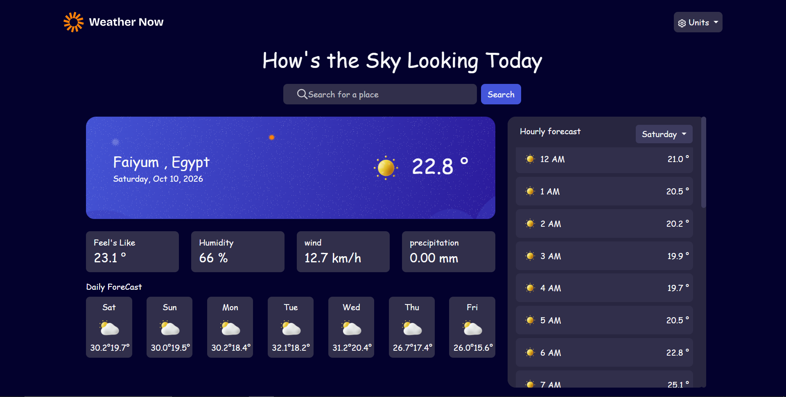

# Frontend Mentor - Weather App solution

This is a solution to the [Weather app challenge on Frontend Mentor](https://www.frontendmentor.io/challenges/weather-app-k8Z9dh37mb). Frontend Mentor challenges help you improve your coding skills by building realistic projects.

## Table of contents

- [Overview](#overview)
  - [The challenge](#the-challenge)
  - [Screenshot](#screenshot)
  - [Links](#links)
- [My process](#my-process)
  - [Built with](#built-with)
  - [What I learned](#what-I-learned)
  - [Continued development](#continued-development)
- [Author](#author)

## Overview

### The challenge

Users should be able to:

- Search for weather information by entering a location in the search bar.
- View current weather conditions including temperature, weather icon, and location details.
- See additional weather metrics like "feels like" temperature, humidity percentage, wind speed, and precipitation amounts.
- Browse a 7-day weather forecast with daily high/low temperatures and weather icons.
- View an hourly forecast showing temperature changes throughout the day.
- Switch between different days of the week using the day selector in the hourly forecast section.
- Toggle between Imperial (Fahrenheit, mph, inches) and Metric (Celsius, km/h, mm) measurement units via the units dropdown.
- View the optimal layout for the interface depending on their device's screen size (Responsive Design).
- See interactive hover, focus, and loading states for all elements on the page.

### Screenshot

### Links

- Solution URL: [(https://github.com/Amro6779/Weather-App-Updated-)]
- Live Site URL: [(https://weather-app-pi-seven-58.vercel.app/)]

## My process

### Built with

- Semantic HTML5 markup
- CSS custom properties (Variables)
- Flexbox & CSS Grid
- Mobile-first and Responsive Media Queries
- [Bootstrap 5](https://getbootstrap.com/) - CSS Framework
- Vanilla JavaScript (ES6+, Async/Await, Geolocation API)
- [Open-Meteo API](https://open-meteo.com/) - Free weather data & geocoding

### What I learned

Building this project was a fantastic experience to handle complex API integration and state management using vanilla JavaScript. Some key highlights include:

- **Dynamic Unit Conversion:** Managing a centralized `weatherUnits` state object that instantly recalculates and updates temperature, wind speed, and precipitation metrics across all components when users switch units.
- **Asynchronous Data Flow:** Handling multiple dependent API calls (fetching location coordinates via Open-Meteo/Nominatim, followed by fetching current, daily, and hourly weather forecasts).
- **Interactive UI Updates:** Dynamically populating the dropdown list for days of the week and filtering hourly weather arrays based on user selection.
- **Responsive Layout Architecture:** Crafting custom media queries to seamlessly adapt the desktop dashboard grid into a mobile-friendly stack layout.

### Continued development

In future projects, I plan to:
- Explore modern front-end frameworks like React or Vue to manage application states more declaratively.
- Implement caching strategies (like LocalStorage) to save recent search history and reduce unnecessary API calls.

## Author

- Frontend Mentor - [https://www.frontendmentor.io/profile/Amro6779]
- GitHub - [https://github.com/Amro6779]